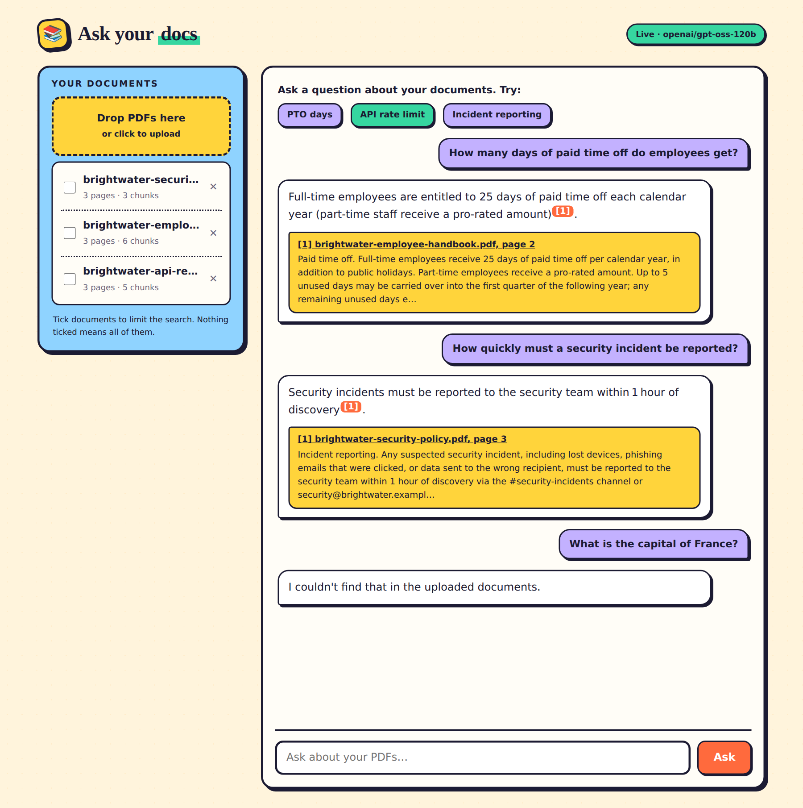
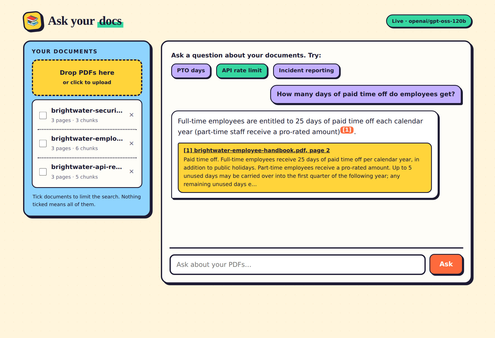

# docs-rag-chatbot

Upload PDFs and ask questions about them. Every answer cites the source document and page number. It runs locally for free.

## Screenshots

Asking questions about the three sample PDFs. Each answer cites the document and page, and the `[1]` badges link to the PDF. A question the documents don't cover gets an honest "I couldn't find that" instead of a guess.



Zoomed in on one answer, with the source passage the citation points to:



## What it does

- **Upload PDFs** from the web page or through the API. Text is extracted page by page and split into overlapping chunks, and a chunk never spans two pages. The chunks are embedded locally with `all-MiniLM-L6-v2` and stored in ChromaDB.
- **Ask questions.** The most relevant chunks are sent to an open model (gpt-oss-120b) on Groq's free tier. The model has to answer from those chunks only and cite them as `[1]`, `[2]`, and so on.
- **Citations you can click.** Each `[n]` maps to a filename and page, and clicking it opens the PDF at that page. If the model cites a source that doesn't exist, the marker is removed.
- **Honest when it doesn't know.** A question the documents don't cover gets "I couldn't find that in the uploaded documents." instead of a guess.
- **Duplicate detection.** Re-uploading the same file is detected by its SHA-256 hash, so the file isn't indexed twice.
- **Searching specific documents.** You can limit a question to chosen documents from the page or with the `doc_ids` field in the API.
- **Ready to try.** Three sample PDFs (a fictional company's handbook, API reference and security policy) are indexed on startup, so you can ask questions right after cloning.

## Quickstart

With Docker:

```bash
git clone https://github.com/joel819/docs-rag-chatbot.git && cd docs-rag-chatbot
docker compose up
```

Without Docker (Python 3.11+):

```bash
git clone https://github.com/joel819/docs-rag-chatbot.git && cd docs-rag-chatbot
pip install -r requirements.txt
uvicorn main:app
```

Open http://localhost:8000 and try "How many days of paid time off do employees get?". The interactive API docs are at http://localhost:8000/docs.

The first run without Docker downloads the embedding model once (about 90 MB). The Docker image already contains it.

Run the tests with `pytest`. There are 33 tests, and they need no API key, no model download and no network access.

## API

| Method | Path | Purpose |
|---|---|---|
| `POST` | `/documents` | Upload a PDF (multipart field `file`) |
| `GET` | `/documents` | List indexed documents |
| `GET` | `/documents/{id}/file` | View the PDF (append `#page=N`) |
| `DELETE` | `/documents/{id}` | Remove a document and its vectors |
| `POST` | `/ask` | `{"question": "...", "doc_ids": null}` returns the answer with citations |
| `GET` | `/health` | Mode, models, document and chunk counts |

Example `/ask` response:

```json
{
  "answer": "Full-time employees receive 25 days of paid time off per calendar year [1].",
  "citations": [
    {"n": 1, "doc_id": "…", "filename": "brightwater-employee-handbook.pdf", "page": 2,
     "snippet": "Paid time off. Full-time employees receive 25 days…", "score": 0.71}
  ],
  "mode": "groq"
}
```

## Architecture

```
            upload                                         ask
              │                                             │
   ┌──────────▼──────────┐                      ┌──────────▼──────────┐
   │ ingest/pdf_reader   │ text per page        │ rag/retriever       │ embed question,
   │ ingest/chunker      │ page-bound chunks    │                     │ top-k from Chroma
   │ rag/embeddings      │ MiniLM (local)       └──────────┬──────────┘
   └──────────┬──────────┘                                 │ numbered sources
              │                                 ┌──────────▼──────────┐
   ┌──────────▼──────────┐                      │ llm/ (Groq or       │ answer with [n]
   │ ChromaDB (vectors)  │◄─────────────────────│ canned fallback)    │
   │ SQLite (documents)  │                      └──────────┬──────────┘
   └─────────────────────┘                      ┌──────────▼──────────┐
                                                │ rag/answer          │ [n] → file + page
                                                └─────────────────────┘
```

```
main.py                 uvicorn entrypoint
app/
  config.py             settings; demo_mode = no GROQ_API_KEY
  db.py, models.py      SQLite via SQLAlchemy (document metadata, content hash)
  schemas.py            request/response models
  ingest/               pdf_reader → chunker → pipeline (dedupe, embed, store, rollback on failure)
  rag/                  embeddings, vector_store (Chroma), retriever, prompts, answer
  llm/                  LLMClient protocol: groq_client (openai package), canned_client (demo)
  routers/              health, documents, chat
  static/index.html     single-page UI, plain JS, no build step
scripts/
  seed.py               index sample_docs/ (idempotent)
  make_sample_pdfs.py   regenerate the sample PDFs
sample_docs/            3 fictional sample PDFs
tests/                  offline pytest suite
```

**Design choices:**

- **Chunks never span pages.** A chunk that covered two pages would need two page numbers, so each chunk stays on one page and every citation points to exactly one page.
- **Chroma stores the embeddings we compute.** We pass them in with `embedding_function=None`, so Chroma never downloads its own model and the vectors always come from the configured embedder.
- **Swappable LLM.** Everything talks to the `LLMClient` protocol. `get_llm()` returns the Groq client when a key is set and the canned client otherwise. If a Groq call fails (rate limit, network), the request falls back to the canned answer and returns `"mode": "fallback"` instead of an error.
- **CPU-heavy work runs off the event loop.** Embedding and LLM calls run in a thread pool so the server keeps responding during a large upload.

## Demo mode

**It runs free, with no API keys.**

| Piece | Cost |
|---|---|
| Embeddings: sentence-transformers `all-MiniLM-L6-v2` on your CPU | free |
| Vector store: ChromaDB in `./data/chroma` | free |
| Database: SQLite in `./data/app.db` | free |
| LLM: Groq free tier. Without a key, the canned extractive answerer is used | free |

When `GROQ_API_KEY` is empty, answers come from the canned client. It picks the sentences in the retrieved chunks that best match your question and cites where each one came from. Everything it says is quoted from your documents, so it can't make things up. The answers read less naturally than an LLM's, and `/health` shows `"demo_mode": true`.

For full answers, get a free key at https://console.groq.com/keys, put it in `.env` as `GROQ_API_KEY=...`, and restart.

To run fully offline, including without the model download, set `EMBEDDING_BACKEND=hash`. That switches to a keyword-based embedder, which retrieves worse than MiniLM but needs nothing downloaded. The tests use it.

## Configuration

Every variable is listed with its default in [`.env.example`](.env.example).
